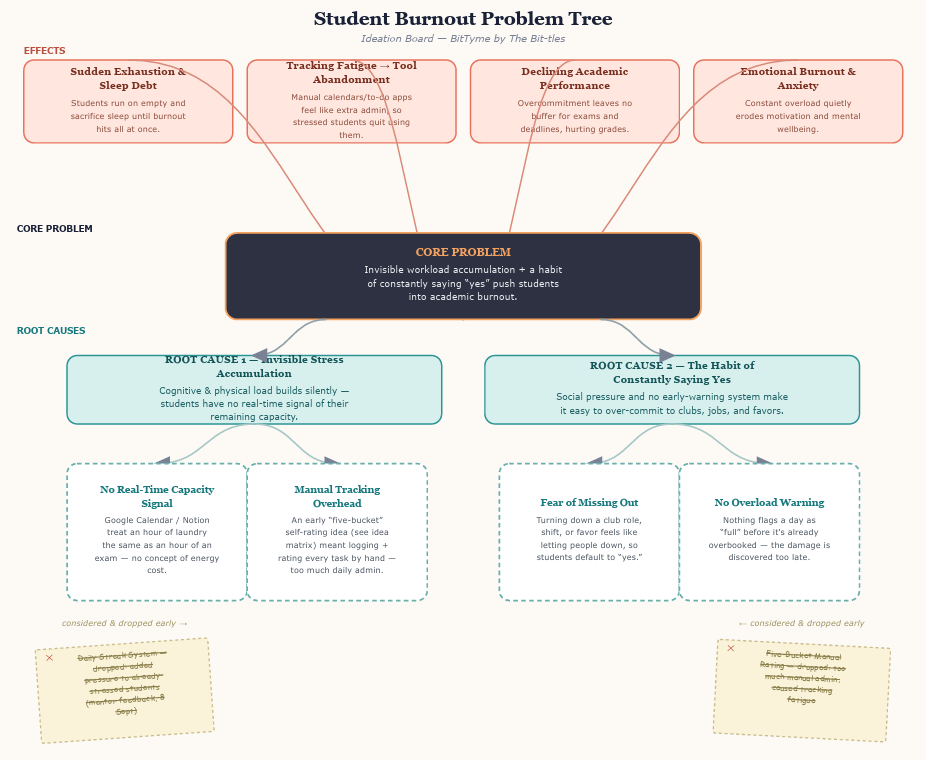
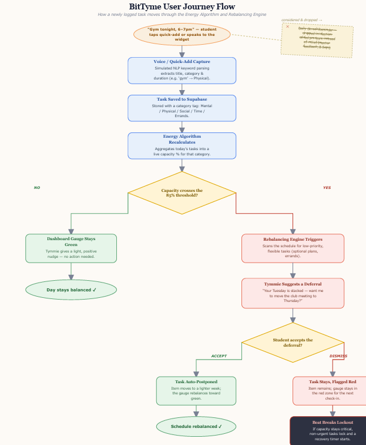
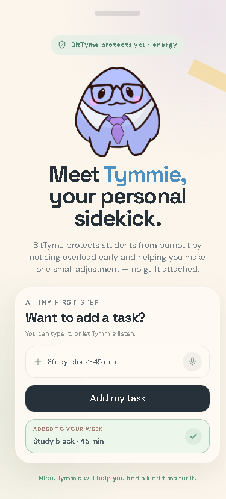
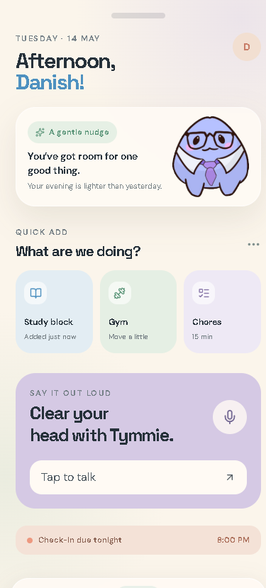
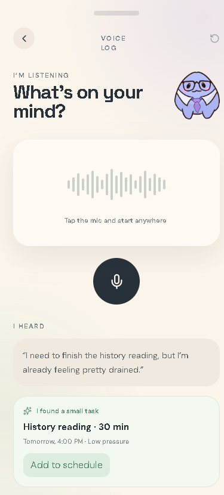
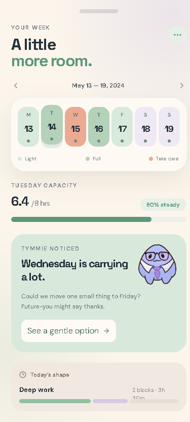
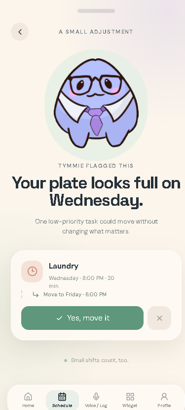
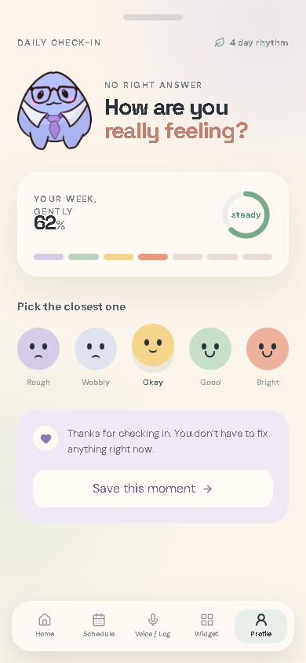
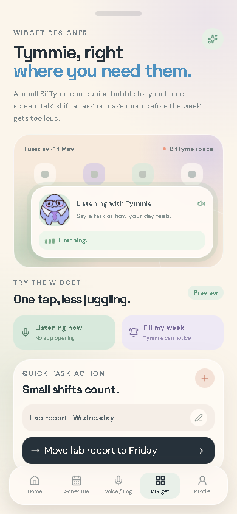

# 🥁 BitTyme by The Bit-tles
**Problem Statement:** Beating the Burnout (Stress & Workload Manager)  
**Video Presentation:** [Insert Unlisted YouTube Link Here]  
**Presentation Slides:** [Insert Public Google Slides or Canva Link Here]  

---

## 📋 Team Members ("The Bit-tles")
* **Danish Firdaus** - Product Lead
* **Muhaimin** - UI/UX Designer
* **Haqemy** - Tech Lead & Architect
* **Ben Mudassir** - Pitch Lead & Storyteller

---

## 1. Project Overview

### 🎯 The Problem

#### Problem Context and Root Causes
For university students, academic burnout is rarely triggered by a single massive event, such as a final exam. Instead, it is the cumulative result of a silent, multi dimensional pile up of daily stressors. Students constantly juggle lectures, part time employment, group projects, student club commitments, and basic household errands. Because cognitive and physical stress accumulation is invisible, students struggle to gauge their active limits. They continuously accept new responsibilities, sacrifice sleep, and run on empty until sudden exhaustion hits.

#### The Target Stakeholders
Our primary users are highly active university students who balance complex, non academic responsibilities alongside their degree programs. This includes working student professionals, student organization leaders, and final year students managing intensive research projects.

#### Why Existing Market Solutions Fail
Industry standard tools like Google Calendar, Notion, and Todoist are fundamentally time centric or task centric. They treat a calendar hour of passive laundry exactly the same as a calendar hour of a high stakes examination. These applications operate under the assumption of infinite human capacity, encouraging users to pack schedules with back to back blocks. 

Furthermore, traditional productivity software relies on constant manual input, tedious self categorization, and active list management. This administrative overhead creates heavy cognitive friction, quickly causing tracking fatigue and forcing busy students to abandon the software entirely. They fail to account for real cognitive and emotional bandwidth limits, allowing users to overbook themselves continuously until burnout occurs.

---

### 🥁 Our Solution: BitTyme

BitTyme is an intelligent, voice first personal workload assistant and conversational wellness companion designed to protect students from academic burnout. 

Instead of forcing users to manage tedious calendars and stress inducing to do lists, BitTyme acts as a proactive helper. By combining background schedule intelligence with a supportive companion mascot, the application completely removes the administrative burden of staying organized. BitTyme shifts the focus from simple time tracking to active, conversational workload protection.

---

### ✨ Key Features

#### 1. Hands Free Voice Widget
Students can add, schedule, or update any task on their calendar simply by speaking to a home screen widget. The conversational artificial intelligence automatically parses the task details in the background, completely eliminating the need to open the app or type manual entries on the go.

#### 2. Smart Greeting and Frequent Task Shortcuts
When you launch the application, BitTyme immediately welcomes you with a personalized greeting screen that proactively asks if you would like to log a task. The system automatically learns your daily routines and saves your most frequent activities as one tap shortcuts, allowing you to log recurring study blocks, gym workouts, or routine chores instantly without repeating details.

#### 3. Active Schedule Rebalancing 
This is the core engine of BitTyme. When the system detects that your schedule is getting too packed, it actively intervenes. The app automatically scans your database, flags low priority responsibilities such as optional social commitments or non urgent errands, and suggests postponing them to a lighter week. This active postponement ensures your schedule dynamically adapts to your actual cognitive capacity, keeping your daily workload balanced.

#### 4. Interactive Mascot Companion
Rather than presenting a cold, clinical utility dashboard, BitTyme introduces an animated mascot to serve as the face of the platform. This companion makes the artificial intelligence integration feel warm, alive, and supportive, acting as a personal advocate for student mental and physical well being.

### 2. Ideation & Process

##### 2.1 Ideas We Considered

We explored several distinct concepts during our initial brainstorming sessions before choosing our final direction. Below is the exact matrix of the ideas we evaluated and the rationale behind our decisions.

| Idea | Why it was dropped / kept |
| :--- | :--- |
| **Active Schedule Rebalancing** | **Kept.** This core engine directly resolves the passivity of traditional calendars by actively protecting student bandwidth. Instead of merely tracking and reporting stress levels, the system dynamically analyzes active workload limits and automatically suggests postponing low priority tasks to lighter weeks. This feature was highly validated during mentor consultations as our primary market differentiator and our most impactful product innovation. |
| **Streak System** | **Dropped.** We considered introducing a TikTok style daily streak system to encourage consistent task updates and increase engagement. However, mentor feedback highlighted that daily streak requirements introduce unnecessary psychological pressure on already stressed students. Forcing a busy student to log in daily simply to preserve a virtual streak transforms a supportive wellness companion into an administrative burden, actively worsening the very academic burnout we are trying to prevent. |
| **five bucket system** | **Dropped.** Requiring busy students to manually log and self rate every single task across multiple categories creates heavy cognitive friction and tracking fatigue. This administrative burden risks causing user burnout, turning a wellness tool into an exhausting daily chore rather than a helpful assistant. |

### 2.2 Ideation Boards &amp; Visual Diagrams 

#### 1. Student Burnout Problem Tree 

 
*Figure 1: The Problem Tree maps the core causes of academic burnout, connecting invisible stress accumulation to severe outcomes like sleep debt and tool abandonment.*

* **Core Problem Identified:** Invisible workload accumulation combined with a habit of constantly saying yes pushes students into academic burnout. 
* **Root Cause 1 (Invisible Stress Accumulation):** Traditional calendar tools treat an hour of laundry identically to an hour of an exam, providing no real time signal of remaining energy capacity. 
* **Root Cause 2 (Habit of Constantly Saying Yes):** Fear of missing out and a lack of early overload warnings make it easy for students to overcommit before realizing their daily schedule is full. 
* **Key Ideation Takeaway:** Highlighting early dead ends such as manual rating buckets and streak counters proved that our solution needed to focus on passive tracking and effortless interaction. 

--- 

#### 2. BitTyme User Journey Flow 

 

*Figure 2: The User Journey Flow illustrates how a newly captured task moves through natural language parsing, Supabase storage, energy recalculation, and the rebalancing engine.* 

* **Effortless Input & NLP Parsing:** A spoken or quick added entry like "Gym tonight 6 to 7pm" is parsed via natural language processing into a structured task with energy category tags like Physical or Mental. 
* **Live Energy Recalculation:** The system aggregates total daily commitments stored in Supabase. If total capacity remains below the 85% threshold, the dashboard gauge stays green with an encouraging message from Tymmie. 
* **Smart Intervention & Beat Breaks Lockout:** Crossing the 85% capacity threshold triggers the Rebalancing Engine to suggest shifting non urgent tasks to lighter weeks. Dismissing critical overload activates a Beat Breaks lockout to safeguard student recovery time.

We consulted with hackathon mentors during the prototype week to pressure test our concept and refine our user experience.

| Date | Mentor | Feedback Received | What Was Changed |
| :--- | :--- | :--- | :--- |
| 8 September 2026 | Danial Koh Yu Hang | The mentor raised critical concerns regarding cognitive friction and tracking fatigue. Requiring students to manually log and self rate every daily task across five categories creates heavy administrative overhead. This manual effort risks causing user burnout, turning a wellness tool into an active chore rather than a relief. | We completely eliminated the manual five bucket tracking system. To reduce cognitive friction, we integrated conversational artificial intelligence that allows users to add tasks simply by speaking through a home screen widget, without even opening the app. We also introduced an interactive companion mascot as the face of the application. Now, when users open BitTyme, they are immediately welcomed and assisted, shifting the app experience from tedious data entry to passive, friendly support. |
| 11 September 2026 | Janelle Tan | The mentor strongly validated the core product concept, stating she could personally see herself using the app daily. However, she noted that the initial user interface was visual lackluster and unintuitive, making feature navigation and overall app flow hard to understand. | We completely overhauled our user interface design system from the ground up. We implemented high contrast visual hierarchy, vibrant cards, clear layout pathways, and prominent mascot animations to ensure that task entry, schedule rebalancing, and recovery features are effortless to understand at a single glance. |

---

## 3. Design & Prototype

**UI Prototype: https://canva.link/l60hhniv4jvi39q**  

Our user experience strategy is centered on high accessibility, clear visual hierarchy, soothing color accents, and responsive touch controls. Designed around our companion mascot, Tymmie, the interface replaces cold productivity dashboards with a warm, encouraging, and frictionless environment.

Below is the complete walkthrough of our seven key application screens detailing how BitTyme transforms daily workload management.

---

### 📱 Interface Architecture & Screen Walkthrough

#### 1. First Time Welcome Screen (Meet Tymmie)
  
*Figure 1: The welcoming screen introduces Tymmie, establishing BitTyme as a supportive sidekick that helps students make guilt free schedule adjustments.*

Upon launching BitTyme, users are greeted by Tymmie with an encouraging message that offers support without judgment. To eliminate launch friction and maximize daily efficiency, the interface immediately presents a low pressure prompt for instant voice or text logging, while intelligent presets automatically remember each student's most frequent routines.

---

#### 2. Smart Greeting Home Screen (Daily Check In)
  
*Figure 2: The primary dashboard delivers a personalized greeting, a gentle workload nudge, frequent task quick add buttons, and a prominent voice capture card.*

The Smart Greeting Home Screen delivers instant workload clarity while offering effortless, one tap task logging to ease schedule anxiety. Upon entering the dashboard, students receive a personalized greeting evaluating their current calendar availability alongside a soft workload nudge card. To streamline daily organization, the layout features quick add presets for frequent recurring activities like studying or exercising, together with a prominent voice capture card that lets students speak naturally on the go.

---

#### 3. Hands Free Voice Capture Interface
  
*Figure 3: The voice recognition interface converts spoken thoughts into structured calendar tasks using natural language processing.*

The Hands Free Voice Capture Interface removes all typing barriers to enable rapid task logging during busy or mobile moments. Powered by natural language processing, the system listens to casual spoken phrases and automatically extracts task titles, deadlines, and time estimates. It then presents an instant task preview displaying the calculated duration, allowing students to confirm and integrate converted items into their digital calendar with a single tap.

---

#### 4. Workload Capacity Calendar View
  
*Figure 4: The calendar dashboard visualizes daily workload density through intuitive color coding to prevent overcommitment.*

The Workload Capacity Calendar View offers visual clarity on daily bandwidth limits to help students spot upcoming exhaustion risks before overcommitting. The interface features a color coded schedule overview that distinguishes between light, balanced, and overburdened days across the workweek. By incorporating capacity intensity bars to display real time workload weight alongside a holistic task breakdown across academic, personal, and life logistics, the layout creates a clean, unified timeline for stress free planning.

---

#### 5. Active Schedule Rebalancing Intervention
  
*Figure 5: Tymmie delivers a proactive rebalancing alert, suggesting automatic task postponements when a day becomes overcrowded.*

The Active Schedule Rebalancing feature proactively protects student mental health by automating schedule relief during peak overload. When total daily commitments exceed safe capacity limits, Tymmie appears with a gentle overload alert notification. The system automatically identifies non urgent chores or low priority items eligible for rescheduling and provides smart deferral suggestions, allowing students to shift flagged tasks to lighter weeks with a single button press to instantly restore schedule balance.

---

#### 6. Non Judgmental Mood Check In
  
*Figure 6: The daily emotional reflection screen lets students log their current mood and track emotional consistency over time.*

The Non Judgmental Mood Check In screen encourages self awareness and emotional reflection without pressuring students toward artificial positivity. Featuring five affective mood options with expressive icons ranging from Rough to Bright, the layout allows students to record their internal state while receiving reassuring messaging that reminds them there is no wrong answer. Furthermore, a weekly progress summary visualizes mood consistency over time, helping students connect workload spikes with emotional fatigue to cultivate self compassion.

---

#### 7. Home Screen Widget Designer
  
*Figure 7: The quick access mobile widget enables hands free voice logging and rapid task reorganization directly from the phone home screen.*

The Home Screen Widget Designer provides full widget customizability directly within the application to deliver instant utility without requiring students to open the full interface. Designed with a compact mobile footprint that sits on the phone home screen for maximum accessibility, the widget features a voice activated shortcut for students to tap, speak, and edit their schedule on the go between classes. Furthermore, rapid task reorganization controls allow users to shift deadlines or clear schedule space in seconds directly from the widget.

---

## 4. What Makes It Different

BitTyme is not a typical calendar or task list application. It functions as an active, supportive companion that shields students from burnout. Below is our strategic market differentiation showing why we stand out from traditional productivity tools.

* **Zero Friction Voice Capture:** Standard applications like Notion and Todoist require constant manual typing, self categorization, and tedious list editing, which quickly leads to tracking fatigue. BitTyme completely eliminates this administrative barrier by allowing users to schedule and manage tasks instantly through a hands free voice widget.
* **Proactive Schedule Rebalancing:** Popular tools like Google Calendar are passive grids that let users overbook themselves continuously without warning. BitTyme actively analyzes schedule density in the background, intervenes when workloads cross critical limits, and suggests postponing low priority tasks to lighter weeks to protect student sanity.
* **Interactive Wellness Companionship:** Standard productivity tools are sterile, cold, and clinical. BitTyme introduces a supportive mascot companion as the face of the application. This companion makes task management feel warm, conversational, and highly personal, shifting the user experience from an administrative chore into an active support system.

---

### 5. Technical Architecture & Feasibility

### Tech Stack

To keep BitTyme realistic to build within the hackathon timeline while still delivering our core differentiator — active, conversational workload protection — we selected a lightweight, entirely free-tier developer stack.

### Frontend: (React Native with Expo)
Why we chose it: A single JavaScript/TypeScript codebase runs natively on both iOS and Android. Expo Go lets our team and judges run the live app instantly on a physical device by scanning a QR code, with no build pipeline needed for demoing.
  * Expected constraints: Expo's managed workflow does not support true OS-level home screen widgets without ejecting to a bare native workflow, which would break our free, low-friction build process. We are implementing      voice capture as an in-app microphone button rather than a true home screen widget for this build, with a genuine OS widget noted as a future native extension.

### Backend & Database: (Supabase (PostgreSQL))
Why we chose it: Supabase provides a managed Postgres database with built-in authentication and auto-generated APIs, letting us avoid building a custom backend during a time-constrained build phase. The free tier requires no card and comfortably covers our scale.
  * Expected constraints: The free tier limits concurrent active database connections, so we will write efficient, batched queries for the energy algorithm rather than polling continuously.

### Voice & AI Task Parsing: (Simulated for this build)
Why we chose it: Real speech-to-text and AI-based task parsing (e.g. Whisper, or an LLM API) require paid usage-based billing beyond initial trial credits, which falls outside our free-tier constraint. To stay within budget while still demonstrating the intended experience, the prototype simulates this: tapping the mic shows a brief listening state, then parses input using local keyword matching (e.g. "gym" → Physical, "essay" → Mental) rather than a live API call.
  * Expected constraints: This is an intentional scope decision, not a technical limitation — our team understands the real implementation path (speech-to-text API feeding an LLM prompt for categorization) and has scoped it   as a clearly-labelled future integration once the project has a funding or billing plan in place.

### Hosting & Deployment: Replit + Expo Go
Why we chose it: Replit hosts our development environment with built-in secrets management and Git sync to our public repo, all on its free tier. Expo Go handles running and testing the app on physical devices without needing paid build services.
  * Expected constraints: We are intentionally not using Expo Application Services (EAS) builds, since Expo Go alone satisfies the deployability requirement and EAS's free tier has limited monthly build quotas. Replit's       free tier can also be slower with multiple simultaneous collaborators, so we test critical flows on physical devices ahead of demo time rather than relying solely on Replit's live preview.

### System Architecture Diagram

  

### Build Plan & Scope
Our initial prototype (submitted for the ideation round) used mock, locally-stored data to demonstrate the Tempo Dashboard, Tempo Balancer, and Beat Breaks screens. The 3-week build phase below scopes the work to implement the full, real system behind them.

* Week 1: Base Core & Authentication (Sept 21 – Sept 27)
    Set up user registration and login flows using Supabase Auth.
    Initialise the PostgreSQL schema for tasks and capacity categories (mental, time, physical, social, errands), and link tables to the app.
    Connect the Tempo Dashboard's capacity gauges to real, persisted data.

* Week 2: Energy Algorithm & Tempo Balancer (Sept 28 – Oct 4)
    Build the client-side energy algorithm that aggregates logged tasks into live capacity percentages per category.
    Develop the Tempo Balancer pop-up, which queries the database for low-priority tasks to defer when a gauge crosses the eighty-five percent threshold.
    Build the task input screen, including the simulated mic-button voice capture flow.

* Week 3: Beat Breaks & Deployment (Oct 5 – Oct 11)
    Implement the Beat Breaks lockout screen and recovery timer for critical (red zone) capacity states.
    Add mascot animations (Lottie) to the greeting screen and key interaction points.
    Run end-to-end testing on physical devices via Expo Go, then finalise the build and generate a scannable QR code for judges.
